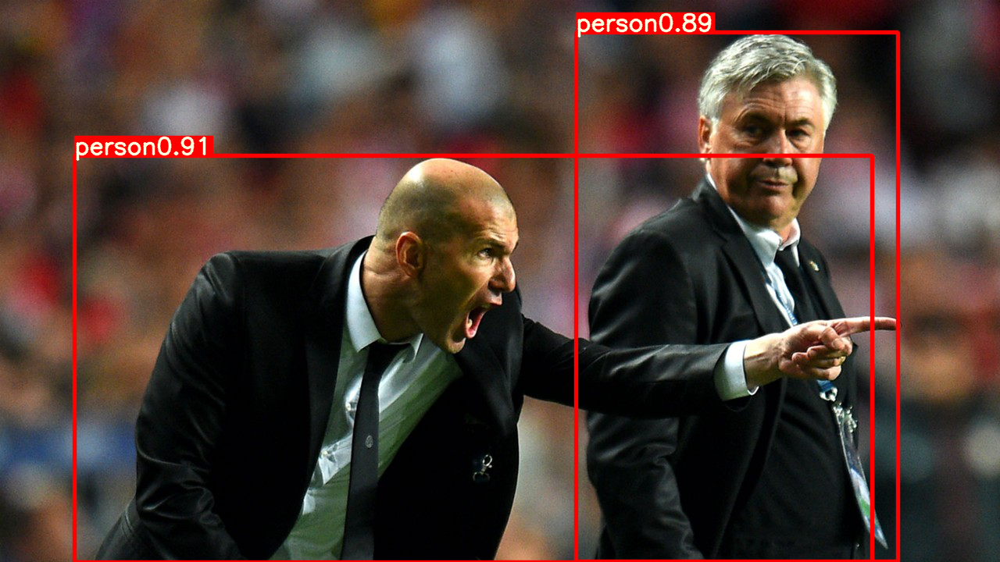

# YOLOv5_single_image_detection
## A simplified function for yolov5 object detection
[Official Installation of YOLOv5](https://github.com/ultralytics/yolov5 "YOLOv5 official")  
The original code from yolov5 can be easily used for object detection. One can conveniently install your yolov5 following the link above.  
This repository offers a simple function that could be used for detecting any single image instead of images in common datasets.   
Also with this function, you can get the result of the coordinates of detection b-boxes.  
### Method
`single_img_detect.py`This file is the main file, modified from the original file `detect.py`. The function named `run` could be used directly instead of using the command line as well as the argparse. So you can run this .py file and get the output results.  
I wrote a function named `my_load_single_img` to process any single image in `datasets.py`, which is imported in `single_img_detect.py`. You need to replace this `datasets.py` in the folder of the official code (the link above), `utils/datasets.py`.  
* Run the `single_img_detect.py`, you may get the output image as below.  
  
  

  
